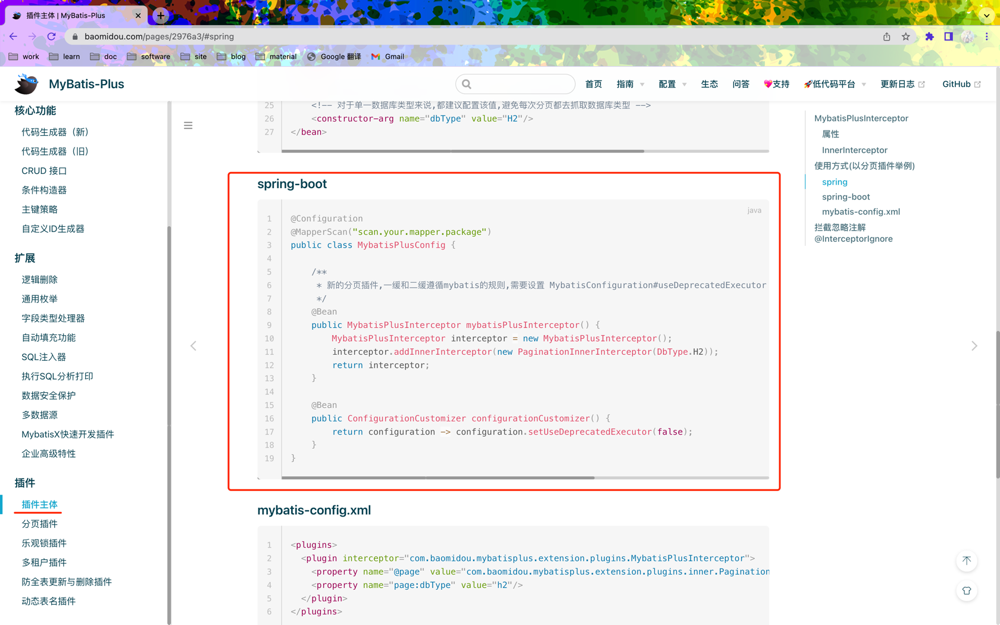

## 搭建五个基础工程


* pom.xml

```xml
    <!-- 以 gmall 工程作为父工程 -->
    <parent>
        <groupId>com.atguigu</groupId>
        <artifactId>gmall</artifactId>
        <version>0.0.1-SNAPSHOT</version>
    </parent>
```

```xml
    <dependencies>
        <!-- gmall 公共依赖 -->
        <dependency>
            <groupId>com.atguigu</groupId>
            <artifactId>gmall-common</artifactId>
            <version>0.0.1-SNAPSHOT</version>
        </dependency>

        <!-- web 启动器 -->
        <dependency>
            <groupId>org.springframework.boot</groupId>
            <artifactId>spring-boot-starter-web</artifactId>
        </dependency>

        <!-- openfeign -->
        <dependency>
            <groupId>org.springframework.cloud</groupId>
            <artifactId>spring-cloud-starter-openfeign</artifactId>
        </dependency>

        <!-- nacos -->
        <dependency>
            <groupId>com.alibaba.cloud</groupId>
            <artifactId>spring-cloud-starter-alibaba-nacos-discovery</artifactId>
        </dependency>
        <dependency>
            <groupId>com.alibaba.cloud</groupId>
            <artifactId>spring-cloud-starter-alibaba-nacos-config</artifactId>
        </dependency>

        <!-- sentinel -->
        <dependency>
            <groupId>com.alibaba.cloud</groupId>
            <artifactId>spring-cloud-starter-alibaba-sentinel</artifactId>
        </dependency>

        <!-- zipkin -->
        <dependency>
            <groupId>org.springframework.cloud</groupId>
            <artifactId>spring-cloud-starter-zipkin</artifactId>
        </dependency>

        <!-- mybatis plus -->
        <dependency>
            <groupId>com.baomidou</groupId>
            <artifactId>mybatis-plus-boot-starter</artifactId>
        </dependency>

        <!-- redis -->
        <dependency>
            <groupId>org.springframework.boot</groupId>
            <artifactId>spring-boot-starter-data-redis</artifactId>
        </dependency>

        <!-- mysql -->
        <dependency>
            <groupId>mysql</groupId>
            <artifactId>mysql-connector-java</artifactId>
            <scope>runtime</scope>
        </dependency>

        <dependency>
            <groupId>org.springframework.boot</groupId>
            <artifactId>spring-boot-starter-test</artifactId>
            <scope>test</scope>
        </dependency>
    </dependencies>
```

```xml
<?xml version="1.0" encoding="UTF-8"?>
<project xmlns="http://maven.apache.org/POM/4.0.0" xmlns:xsi="http://www.w3.org/2001/XMLSchema-instance"
         xsi:schemaLocation="http://maven.apache.org/POM/4.0.0 https://maven.apache.org/xsd/maven-4.0.0.xsd">
    <modelVersion>4.0.0</modelVersion>

    <!-- 以 gmall 工程作为父工程 -->
    <parent>
        <groupId>com.atguigu</groupId>
        <artifactId>gmall</artifactId>
        <version>0.0.1-SNAPSHOT</version>
    </parent>

    <groupId>com.atguigu</groupId>
    <artifactId>gmall-pms</artifactId>
    <version>0.0.1-SNAPSHOT</version>
    <name>gmall-pms</name>
    <description>谷粒商城 商品管理系统</description>

    <dependencies>
        <!-- gmall 公共依赖 -->
        <dependency>
            <groupId>com.atguigu</groupId>
            <artifactId>gmall-common</artifactId>
            <version>0.0.1-SNAPSHOT</version>
        </dependency>

        <!-- web 启动器 -->
        <dependency>
            <groupId>org.springframework.boot</groupId>
            <artifactId>spring-boot-starter-web</artifactId>
        </dependency>

        <!-- openfeign -->
        <dependency>
            <groupId>org.springframework.cloud</groupId>
            <artifactId>spring-cloud-starter-openfeign</artifactId>
        </dependency>

        <!-- nacos -->
        <dependency>
            <groupId>com.alibaba.cloud</groupId>
            <artifactId>spring-cloud-starter-alibaba-nacos-discovery</artifactId>
        </dependency>
        <dependency>
            <groupId>com.alibaba.cloud</groupId>
            <artifactId>spring-cloud-starter-alibaba-nacos-config</artifactId>
        </dependency>

        <!-- sentinel -->
        <dependency>
            <groupId>com.alibaba.cloud</groupId>
            <artifactId>spring-cloud-starter-alibaba-sentinel</artifactId>
        </dependency>

        <!-- zipkin -->
        <dependency>
            <groupId>org.springframework.cloud</groupId>
            <artifactId>spring-cloud-starter-zipkin</artifactId>
        </dependency>

        <!-- mybatis plus -->
        <dependency>
            <groupId>com.baomidou</groupId>
            <artifactId>mybatis-plus-boot-starter</artifactId>
        </dependency>

        <!-- redis -->
        <dependency>
            <groupId>org.springframework.boot</groupId>
            <artifactId>spring-boot-starter-data-redis</artifactId>
        </dependency>

        <!-- mysql -->
        <dependency>
            <groupId>mysql</groupId>
            <artifactId>mysql-connector-java</artifactId>
            <scope>runtime</scope>
        </dependency>

        <dependency>
            <groupId>org.springframework.boot</groupId>
            <artifactId>spring-boot-starter-test</artifactId>
            <scope>test</scope>
        </dependency>
    </dependencies>

    <build>
        <plugins>
            <plugin>
                <groupId>org.springframework.boot</groupId>
                <artifactId>spring-boot-maven-plugin</artifactId>
            </plugin>
        </plugins>
    </build>

</project>

```

* application.yml

```yaml
server:
  port: 18081 # 服务端口号
spring:
  cloud:
    nacos:
      discovery: # 注册中心配置
        server-addr: 192.168.0.101:8848 # nacos 注册中心地址
    sentinel: # 限流配置
      transport:
        dashboard: 192.168.0.101:8080 # sentinel 客户端地址
        port: 8719 # 服务与 dashboard 进行交互的端口
  zipkin: # 链路追踪配置
    base-url: http://192.168.0.101:9411 # zipkin 地址
    discovery-client-enabled: false # 是否监控 zipkin 本身的请求
    sender:
      type: web # 链路数据以什么方式返送给 zipkin. web 使用 http 的形式发送
  sleuth: # 采集率配置
    sampler:
      probability: 1 # 采集率, 默认是 百分之10 生产时使用, 开发应该设置为 1 采集全部请求
  datasource: # MySQL
    driver-class-name: com.mysql.jdbc.Driver
    url: jdbc:mysql://192.168.0.101:3306/guli_pms?useUnicode=true&characterEncoding=utf-8&useSSL=false&serverTimezone=Asia/Shanghai # 连接协议
    username: root
    password: root
  redis: # Redis
    host: 192.168.0.101
    port: 6379
feign: # feign
  sentinel:
    enabled: true # 开启 feign 的 sentinel 功能
mybatis-plus: # mybatis-plus 配置
  mapper-locations: classpath:mapper/pms/**/*.xml # 映射文件地址 classpath 就是 resources
  type-aliases-package: com.atguigu.gmall.pms.entity # 别名包扫描
  global-config:
    db-config:
      id-type: auto # id 策略, 生产应该使用分布式 id. auto 数据库自增
logging: # 查看执行 SQL
  level: # 级别
    com.atguigu.gmall.pms: debug # debug 模式
```

* bootstrap.yml


```yaml
spring:
  application:
    name: pms-service # 服务名称
  cloud:
    nacos:
      config:
        server-addr: 192.168.0.101:8848 # 配置中心地址
        namespace: fd9533e4-be16-4d5a-83f0-90f81b1481ab # 命名空间 ID
        group: dev # 配置文件分组
        file-extension: yml # 配置文件扩展名, 默认是 properties
```

## 逆向工程生成

* pom.xml

```xml
<mysql.version>8.0.20</mysql.version>
```


* application.yml

```yaml
    driverClassName: com.mysql.cj.jdbc.Driver
    url: jdbc:mysql://192.168.0.101:3306/guli_sms?useUnicode=true&characterEncoding=UTF-8&useSSL=false
```


## mybatis - plus 分页插件



