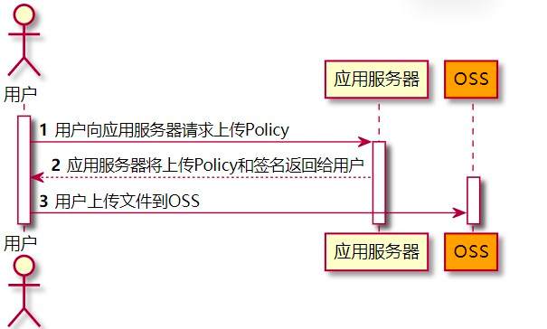

## 搭建网关工程


## Nginx 反向代理 解决端口号问题


```shell
cd /usr/local/nginx/conf/

vim nginx.conf
```

```properties
worker_processes  1;

events {
    worker_connections  1024;
}

http {
    include       mime.types;
    default_type  application/octet-stream;

    sendfile        on;
    keepalive_timeout  65;

    # 代理网关
    server {
        listen          80; # 监听 80 端口
        server_name     api.gmall.com; # 服务器地址或绑定域名

        location / { # 访问80端口后的所有路径都转发到 proxy_pass 配置的ip中
                proxy_pass      http://192.168.0.111:8888; # 配置反向代理的ip地址和端口号 [注：url地址需加上http://]
        }
    }

    # 代理后台管理
    server {
        listen          80; # 监听 80 端口
        server_name     manager.gmall.com; # 服务器地址或绑定域名

        location / { # 访问80端口后的所有路径都转发到 proxy_pass 配置的ip中
                proxy_pass      http://192.168.0.121:1000; # 配置反向代理的ip地址和端口号 [注：url地址需加上http://]
        }
    }
}
```

```shell
// 进入 nginx 目录
cd /usr/local/nginx/sbin

// 重新加载
./nginx  -s  reload
```

## Nginx 加入后流程


> 浏览器输入域名 -> 本机hosts 文件对此域名进行解析 -> 真实发送请求是 ip + 请求路径 -> 根据 ip + 80 端口找到 nginx 服务器 -> nginx 配置了反向代理根据 域名头信息找到 当前 server -> 根据反向代理后的  ip 地址找到网关应用 -> 网关根据 断言配置 路由到对应的 微服务 -> 找到对应的 controller 方法处理 -> 处理完后沿路返回到用户浏览器


## 前后联调


## Cors 跨域

> 跨域：浏览器对于javascript的同源策略的限制, 如果**域名和端口都相同，但是请求路径不同**，不属于跨域. 跨域不一定都会有跨域问题, 因为跨域问题是浏览器对于ajax请求的一种安全限制：**一个页面发起的ajax请求，只能与当前页域名相同的路径**，这能有效的阻止跨站攻击。

以下情况都属于跨域：

| 跨域原因说明       | 示例                                   |
| ------------------ | -------------------------------------- |
| 域名不同           | `www.jd.com` 与 `www.taobao.com`       |
| 域名相同，端口不同 | `www.jd.com:8080` 与 `www.jd.com:8081` |
| 二级域名不同       | `item.jd.com` 与 `miaosha.jd.com`      |
| 协议不同           | `https://jd.com` 和 `http://jd.com`    |


* 解决方案
  * jsonp: 利用 xml 标签解决跨域问题(动态数据两端添加标签)
    * 前后端开发人员协调好
    * 只能解决 get 请求的跨域问题
  * nginx: 代理为不跨域(逃避式的解决方案)
      * 配置 Cors 规范: 违背了 devops 思想
  * cors 规范: 增加服务器端的访问压力
    * 两次请求
      * 预检请求 OPTIONS
          * Access-Control-Allow-Origin：可接受的域，是一个具体域名或者*（代表任意域名）
          * Access-Control-Allow-Credentials：是否允许携带cookie，默认情况下，cors不会携带cookie，除非这个值是true
          * Access-Control-Allow-Methods：允许访问的方式
          * Access-Control-Allow-Headers：允许携带的头
          * Access-Control-Max-Age：本次许可的有效时长，单位是秒，**过期之前的ajax请求就无需再次进行预检了**
      * 真正的请求

* 实现
    * 服务端可以通过拦截器统一实现，不必每次都去进行跨域判定的编写

```java
@Configuration
public class CorsConfig {

    @Bean
    public CorsWebFilter corsWebFilter() {
        // 初始化 一个 cors 配置类对象
        CorsConfiguration configuration = new CorsConfiguration();
        // 允许跨域访问的域名. * 代表所有域名. 不推荐 1. 存在安全问题 2. 不能携带 cookie
        configuration.addAllowedOrigin("http://manager.gmall.com");
        // 允许那些请求方式跨域访问 * 允许所有
        configuration.addAllowedMethod("*");
        // 允许携带的头信息 * 允许所有
        configuration.addAllowedHeader("*");
        // 允许 cookie 跨域访问, 需要满足两点 1. AllowedOrigin 不能写 * 2. 此处需要设置为 true
        configuration.setAllowCredentials(true);

        // 初始化 cors 配置源
        UrlBasedCorsConfigurationSource configurationSource = new UrlBasedCorsConfigurationSource();
        // 注册 cors 配置. /** 针对所有路径 做 cors 配置验证.
        configurationSource.registerCorsConfiguration("/**", configuration);
        return new CorsWebFilter(configurationSource);
    }
}
```

## 阿里云 OSS



```java
@RestController
@RequestMapping("pms/oss")
public class OssController {

    String accessId = "LTAI5tM6zGYSk2mCQvQUH5A6"; // 请填写您的AccessKeyId。
    String accessKey = "7W9fOvhqiKKlxWOVuqPOjCLo4qVPQi"; // 请填写您的AccessKeySecret。
    String endpoint = "oss-cn-hangzhou.aliyuncs.com"; // 请填写您的 endpoint。
    String bucket = "yiki-gmall"; // 请填写您的 bucketname 。
    String host = "https://" + bucket + "." + endpoint; // host的格式为 bucketname.endpoint
    // callbackUrl为 上传回调服务器的URL，请将下面的IP和Port配置为您自己的真实信息。
    //String callbackUrl = "http://88.88.88.88:8888";
    // 图片目录，每天一个目录
    SimpleDateFormat sdf = new SimpleDateFormat("yyyy-MM-dd");
    String dir = sdf.format(new Date()); // 用户上传文件时指定的前缀。

    @GetMapping("policy")
    public ResponseVo<Object> policy() throws UnsupportedEncodingException {

        OSSClient client = new OSSClient(endpoint, accessId, accessKey);

        long expireTime = 30;
        long expireEndTime = System.currentTimeMillis() + expireTime * 1000;
        Date expiration = new Date(expireEndTime);
        PolicyConditions policyConds = new PolicyConditions();
        policyConds.addConditionItem(PolicyConditions.COND_CONTENT_LENGTH_RANGE, 0, 1048576000);
        policyConds.addConditionItem(MatchMode.StartWith, PolicyConditions.COND_KEY, dir);

        String postPolicy = client.generatePostPolicy(expiration, policyConds);
        byte[] binaryData = postPolicy.getBytes("utf-8");
        String encodedPolicy = BinaryUtil.toBase64String(binaryData);
        String postSignature = client.calculatePostSignature(postPolicy);

        Map<String, String> respMap = new LinkedHashMap<String, String>();
        respMap.put("accessid", accessId);
        respMap.put("policy", encodedPolicy);
        respMap.put("signature", postSignature);
        respMap.put("dir", dir);
        respMap.put("host", host);
        respMap.put("expire", String.valueOf(expireEndTime / 1000));
        // respMap.put("expire", formatISO8601Date(expiration));

        return ResponseVo.ok(respMap);
    }
}
```